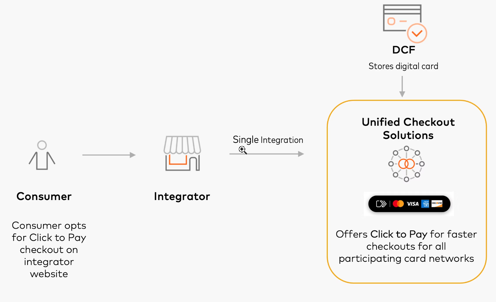
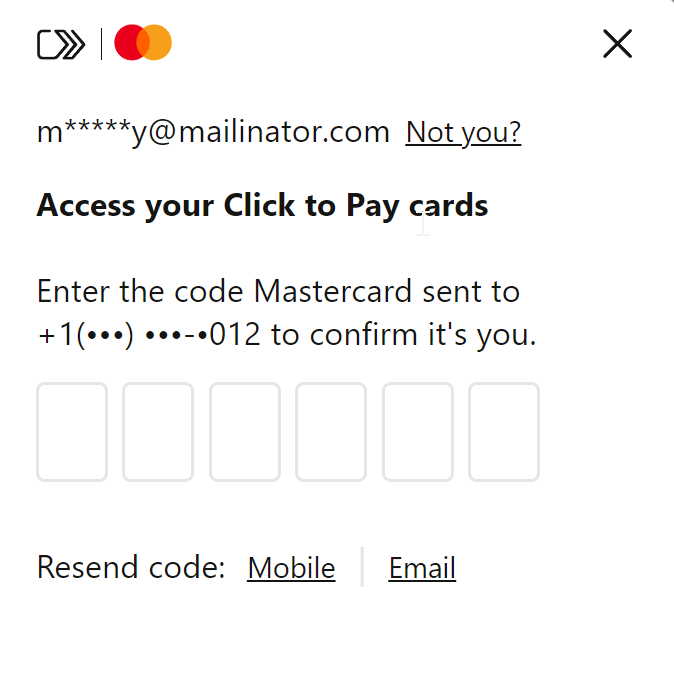
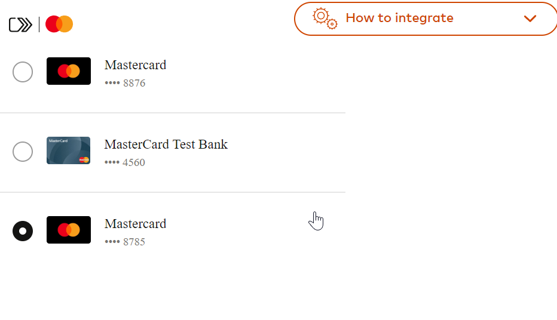
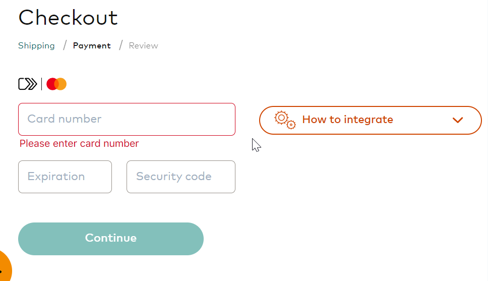

### DCF কী?
DCF-টা হচ্ছে এমন একটা সার্ভিস যেটা **payment network**গুলো দিয়ে থাকে। প্রত্যেকটা নেটওয়ার্কেরই আলাদা আলাদা **DCF** থাকে।

### DCF যেভাবে কাজ করে

* **DCF** কোন কার্ড সিলেক্ট করা হচ্ছে সেটার স্ক্রিনটা দেখায়। 
* যদি আগে থেকে **DCF**-এ কার্ড এড করা থাকে তাহলে শুধু মাত্র কোড ভেরিফিকেশন করলেই সবগুলো কার্ডের লিস্ট দেখাবে। 

{max-width: 40vw} 
{max-width: 40vw} 

* যদি আগে থেকে কার্ড এড করা না থাকে তাহলে কার্ড দিয়ে ট্রানজ্যাকশন করার সময় **DCF**-এ এড করার অপশান দেখাবে।
{max-width: 50vw} 