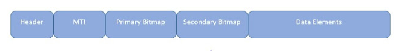

## ISO8583 কী?
* The ISO 8583 protocol is used for systems that exchange electronic transactions initiated by cardholders using payment cards. 
* Basically, when a cardholder uses a payment card, the electronic transaction data is exchanged throughout the network using ISO 8583 data elements, messages and code values.

