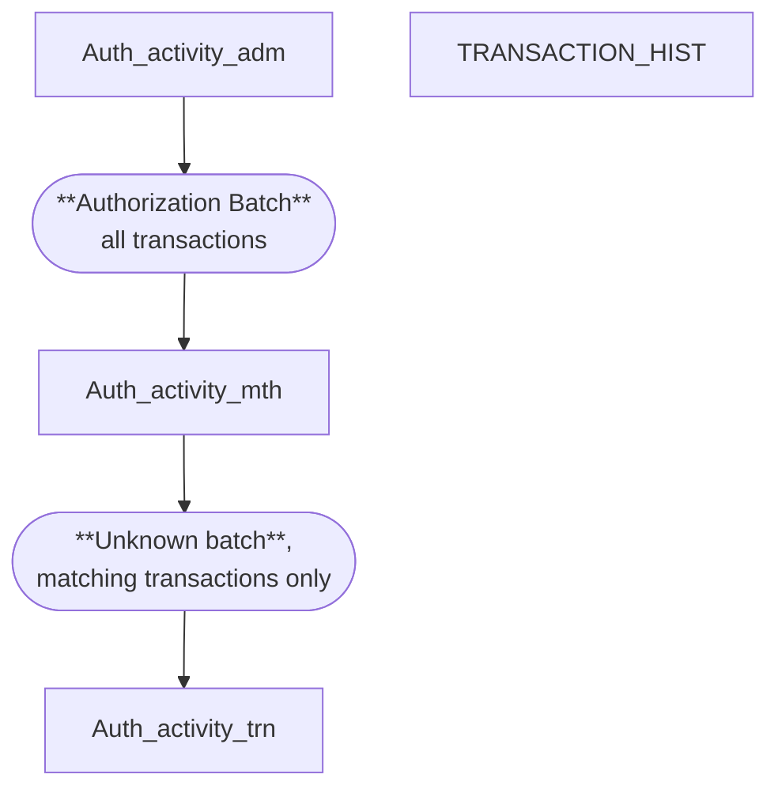

 ch daily batch, pd batch, pin mailer, VISA ARDEF, MC ICA BIN, VISA In(chargeback++), MC IN, POS collection(wth ctrl, without ctrl)(goes to posting file(wuith ctrl/without crtrl->trns_hist), auth batch(auth_act_mph table), trns_ctrl(trns_val_base - pos, auth_act_adm-> auth_act_trn)

### Issuing Batches flow

pos collection -> 1. posting file with control, 2. posting file without control, other switch,  trns_ctrl

### TRANSACTION_HIST
Transaction_hist
* Internal transactions captured via the screen by an end **user**(?). , those transactions are first controlled then moved to ‘TRANSACTION_HIST’ table.
* ফি রিলেটেড ট্রানজ্যাকশনগুলো যেমন ট্র্যানজ্যাকশনের ফি, ডিসকাউন্ট ইত্যাদি। **তবে ডেবিট প্রোডাক্টের ক্ষেত্রে ফি এখানে থাকে না। সেগুলো থাকে `TRANSACTION_HIST_CARD` টেবিলে।
* বাইরের নেটওয়ার্ক যেমন ভিসা বা মাস্টারকার্ডের কাছ থেকে ইনকামিং ফাইলের মাধ্যমে আসা সব ট্রানজ্যাকশন।
* মার্চেন্টদের কাছ থেকে পোস্টিং ফাইলের মাধ্যমে আসা ট্রানজ্যাকশনগুলো।
* POS টার্মিনালগুলোর ট্রানজ্যাকশনগুলো।

> Acquiring হোক বা Issuing ট্রানজ্যাকশন, **TRANSACTION_HIST** টেবিলে প্রায় সব ট্রানজ্যাকশনই থাকে শুধু মাত্র **ডেবিট প্রোডাক্টের ফি** আর **ক্রেডিট প্রোডাক্টের ট্রানজ্যাকশন** বাদে।

### CR_TRANSACTION
ক্রেডিট প্রোডাক্টের ট্রানজ্যাকশনগুলো `Transaction_hist` টেবিলে না রেখে `CR_Transaction` টেবিলে রাখা হয়।